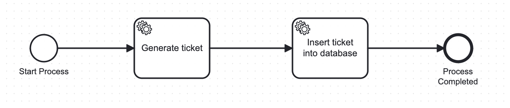

# Email Categorization and Ticketing Application

## **Prerequisites**

1. [Install Ollama](https://ollama.com/library/llama3.2:3b)  
   Ensure Ollama is installed and the `llama3.2` model is ready to run.

2. **Generate Gmail App Password:**  
   Follow [this guide](https://knowledge.workspace.google.com/kb/how-to-create-app-passwords-000009237) to generate an app-specific password for Gmail. Update the password in the application's `properties` file.

3. **Set up Gmail Label:**
    - Create a label named **`Insurance`** in your Gmail account.
    - Set rules to filter and add emails to this label based on keywords such as **`claims`**, **`policy`**, **`renewal`**, etc.

---

## **Description**

This application performs the following functions:

1. **Email Categorization:**
    - Reads emails from the specified Gmail label.
    - Extracts email content to classify it into one of the following categories:
        - **CLAIM**
        - **BILLING**
        - **POLICY_UPDATE**
        - **GENERAL**
        - **ENQUIRY**
        - **COMPLAINT**

2. **Ticket Generation:**
    - If the email matches one of the categories, it generates a ticket using an integrated **BPM model**.
    - This ticket system enables tracking and future reference for each request.

3. **Automated Responses:**
    - Based on predefined prompts in the code, the application sends appropriate responses to the email sender.

4. **RAG-Based Approach:**
    - Implements a **Retrieval-Augmented Generation (RAG)** system to enhance email responses by incorporating contextual data.

---
## **BPM Process Overview**

  
*Figure: The process flow of ticket generation and database insertion.*

---
## **How to Run the Application**

1. **Start Ollama:**
    - Ensure Ollama is running locally with the required model:
      ```bash
      ollama run llama3.2
      ```

2. **Run the Application:**
    - Launch the Spring Boot application using the following command:
      ```bash
      mvn spring-boot:run
      ```

3. **Gmail Label Verification:**
    - Ensure that the Gmail label matches the folder name: **`Insurance`**.
    - The application will process only the emails under this label.
